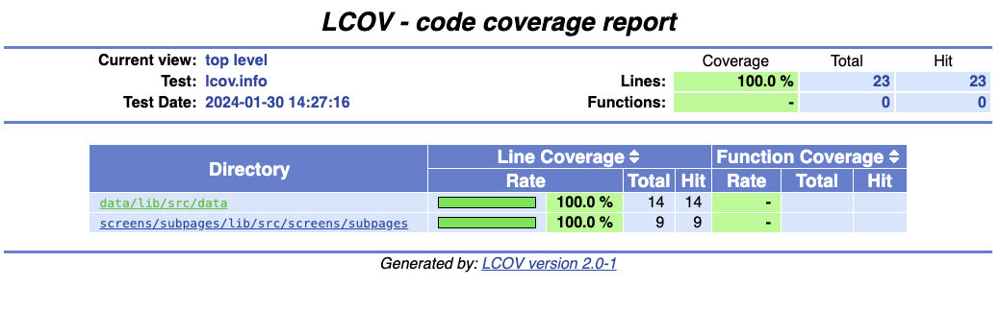

# mobile_app_for_public_health

# Bioinformatics Pipeline using Docker Compose

This project was developed as part of the "Mobile Applications for Public Health" course at HTW Berlin during the winter semester 2023/2024. The objective was to create a mobile medical application with Flutter, which includes a functional prototype to showcase the potential of a concept/product idea. To achieve this goal, a prototype application named GenoMedicine has been developed. This involves analyzing the human genome to identify its variants. Based on these results, potentially harmful drugs for the user can be identified.

## Getting Started

The App is currently designed for iOS systems. To use it, please download and install the following software:

- Xcode
- Download the Xcode simulators for iPhone by following these steps: Open Xcode, then click Menu > Xcode > Preferences > Select Components
- Visual Studio Code

### Next Steps:

1. Open Visual Studio Code and clone this project.
2. In the terminal, run the following command: 
``` bash
open -a simulator 
```
3. Once the simulator is open, type the following command in the Visual Studio Code terminal: `
```bash
flutter run
```

## Troubleshooting

If you encounter an error from Xcode, it's likely that your cache is full. Please clear your cache. On macOS systems, follow these steps:

- Go to System Preferences > Storage > Developer > Clear "Xcode Caches".


## Testing

We used the Flutter Testing Framework to write and run our tests.

To run the test on your local machine go to the flutter path and run:
``` bash
flutter test
```

### Test Coverage



For running the coverage:

1. Make sure you got lcov installed
```bash
brew install lcov
```

2. Generate Coverage Data
```bash 
flutter test --coverage
```

3. Generate the Coverage Report using lcov
```bash
genhtml coverage/lcov.info --output-directory coverage/html
```

4. Open the report
```bash
open coverage/html/index.html
```

# Pipeline

Technologies such as FastP, Bowtie 2, Wgsim, and Freebayes have been containerized in a genomics pipeline for processing genomic data.


## Services

### 1. fastp
- **Image:** biocontainers/fastp:v0.20.1_cv1
- **Description:** Quality control tool for sequencing data.
- **Command:** Processes paired-end FASTQ files and generates cleaned output.

### 2. bowtie2
- **Image:** biocontainers/bowtie2:v2.4.1_cv1
- **Description:** Tool for aligning sequencing reads to long reference sequences.
- **Command:** Builds an index and aligns processed data.

### 3. samtools
- **Image:** biocontainers/samtools:v1.9-4-deb_cv1
- **Description:** Refining alignments of short DNA sequence reads in post-processing tasks.
- **Command:** Converts SAM format to BAM format for downstream processing.

### 4. freebayes
- **Image:** biocontainers/freebayes:v1.2.0-2-deb_cv1
- **Description:** Bayesian tool specialized in detecting genetic variants.
- **Command:** Calls genetic variants from the processed data and generates a VCF file.

## Dockerfile

The Dockerfile sets up the necessary dependencies and tools for the genomics pipeline. It also includes a wrapper script, `pipeline_wrapper.sh`, that orchestrates the execution of the pipeline steps.

## Usage
***
1. Make sure you have Docker installed on your system.
2. Clone this repository to your local machine.
3. Before you build the Docker image, make sure to choose the comparison script you want to use. There are two scripts in the script directory:
- `genome_comparison_CYP2D6_CYP3A4.py`
- `genome_comparison_MTHFR.py` (for testing the pipeline)

## Running `genome_comparison_CYP2D6_CYP3A4.py`
**Note:** Building the Docker image is not required for running `genome_comparison_CYP2D6_CYP3A4.py` as the necessary VCF file, `output.vcf`, is already in "Pipeline/data/" provided.

### Steps:

1. **Create and Activate a Virtual Environment:**
   - On Windows:
     ```bash
     python -m venv venv
     venv\Scripts\activate.bat
     ```
   - On Linux and MacOS:
     ```bash
     python -m venv myvenv
     source myvenv/bin/activate
     ```

2. **Install Dependencies:**
   ```bash
   pip install pandas numpy
   ```
## Running `genome_comparison_MTHFR.py`
**Note** If you want to run genome_comparison_MTHFR.py, all you need to do is follow the next step to build the Docker image and run the pipeline.

1. To build the Docker image, navigate to the directory containing the Dockerfile and run the following command:

```bash
$ docker build -t genomics-pipeline:latest .
$ docker-compose up
```
